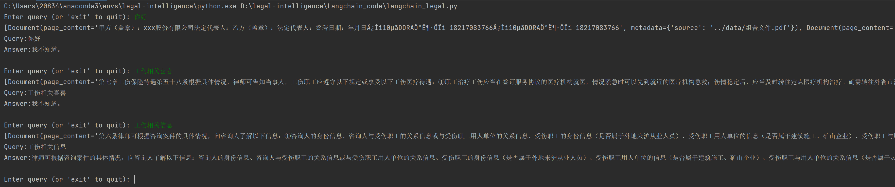
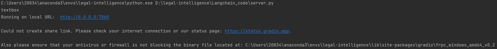
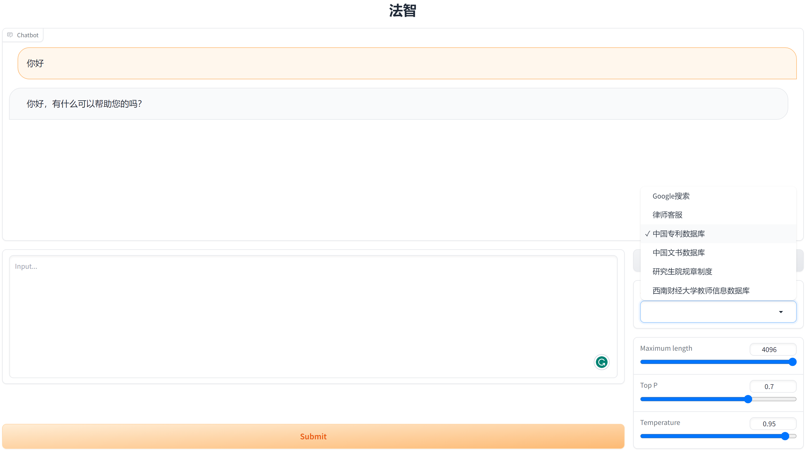

# 法智langchain模型

### 介绍
法智_法律大模型团队的学习仓库

### 项目概述
- data
  - 组合文件.pdf                   # 关于法律事务所的 PDF 文件
  - graduate_system.csv           # 研究生院规则制度表
  - graduate_teacher.csv          # 西南财大老师信息表
- Langchain_code
  - db                            # chromeDB 持久化向量数据库
    - ...  
  - langchain_DB.py               # 使用 langchain 连接不同数据库的代码
  - langchain_Google.pt           # 使用Google serpapi 调用google搜索查找结果
  - server.py                     # 主函数，可视化界面以及主要功能
  - langchain_legal_to_vec.py     # 读取 "../data/组合文件.pdf" 文件并且保存到 "Langchain_code/db" 的向量数据库中
  - langchain_legal.py            # 测试 langchain_legal_to_vec.py" 生成的向量数据库是否可用
- Tutorial
  - [LangChain](https://www.langchain.asia/getting_started/getting_started)  🦜️🔗 中文网 
  - Clash 上网详见文件`./Tutorial/科学上网工具Clash.pdf`

### 项目准备

1.  进入 Langchain_DB 文件夹下，运行：
```bash 
pip install -r requirements.txt
```
2.  将 `data` 目录下的 `组合文件.pdf` 持久化为向量数据
```bash 
# 持久化 组合文件.pdf 为向量数据
python langchain_legal_to_vec.py
```

```bash 
# 进行测试
python langchain_legal.py
```

3.  配置 xxx.csv 文件到 mysql 数据库

### 使用说明

1.  运行项目
```bash 
python server.py
```



### 参与贡献

1.  Fork 本仓库
2.  新建 Feat_xxx 分支
3.  提交代码
4.  新建 Pull Request

### 特技

1.  使用 Readme\_XXX.md 来支持不同的语言，例如 Readme\_en.md, Readme\_zh.md
2.  Gitee 官方博客 [blog.gitee.com](https://blog.gitee.com)
3.  你可以 [https://gitee.com/explore](https://gitee.com/explore) 这个地址来了解 Gitee 上的优秀开源项目
4.  [GVP](https://gitee.com/gvp) 全称是 Gitee 最有价值开源项目，是综合评定出的优秀开源项目
5.  Gitee 官方提供的使用手册 [https://gitee.com/help](https://gitee.com/help)
6.  Gitee 封面人物是一档用来展示 Gitee 会员风采的栏目 [https://gitee.com/gitee-stars/](https://gitee.com/gitee-stars/)
